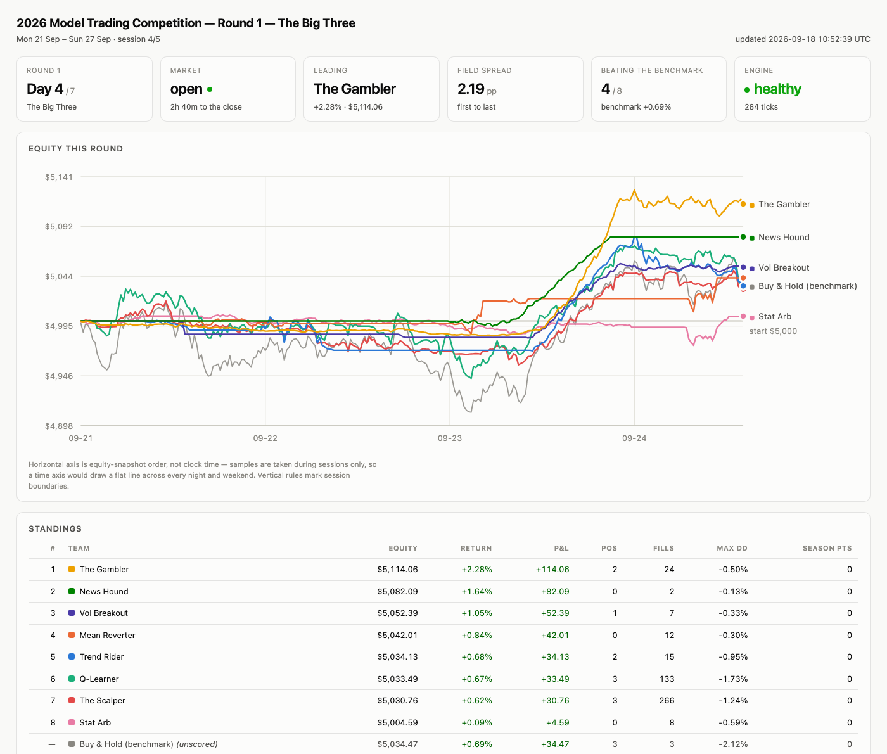

# 2026 Model Trading Competition

Eight autonomous trading strategies compete over three one-week rounds on
Alpaca paper accounts. Each starts every round with **$5,000**, trades as much
as it likes, and is ranked on how much money it made. Most points after three
rounds wins.

No LLM is in the loop at runtime. The models designed these strategies; the
code trades them. Every decision is a deterministic function of market data,
and every decision is written to an auditable ledger.

```
$ comp backtest --round 1 --start 2026-09-07 --end 2026-09-13 --source synthetic

Round 1 -- The Big Three
place  team                      return         P&L   end equity  points
------------------------------------------------------------------------
1      News Hound                2.78%     +138.90     5,138.90    15.0
2      Stat Arb                  2.26%     +113.16     5,113.16    11.0
3      Q-Learner                 1.06%      +52.96     5,098.45     8.0
4      Mean Reverter             0.29%      +14.73     5,014.73     6.0
5      The Gambler              -1.00%      -50.05     4,949.95     5.0
6      The Scalper              -1.81%      -90.53     4,909.47     4.0
7      Trend Rider              -2.31%     -115.38     4,884.62     3.0
8      Vol Breakout             -2.60%     -130.17     4,869.83     2.0
--     Buy & Hold (benchmark)    0.42%      +20.85     5,020.85     0.0  (unscored)

3 of 8 teams beat the benchmark (+0.42%).
```

That run needs no API key and no network. It is how you should first meet this
repo.

---

## The rules

| | Round 1 — The Big Three | Round 2 — Open Market | Round 3 — Chaos Draft |
|---|---|---|---|
| **Universe** | AAPL, GOOGL, MSFT — same for everyone | the whole liquid US market | 10 tickers dealt from the top 500 |
| **Selection** | none | each team's own stock picker | dealt at random, then ranked by the picker |
| **Measures** | execution and risk management | universe selection too | adaptation to a hand you didn't choose |

* **$5,000** per team per round, flat. No carry-over — every round starts level.
* **7 calendar days** per round (4–5 trading sessions).
* Unlimited trading. Long-only, no margin, no shorting.
* Books are **flattened before the final close**, so the round is scored on
  cash rather than on a stale mark.
* Points by finishing place: **15, 11, 8, 6, 5, 4, 3, 2**. Winning a round is
  worth far more than moving up one spot mid-pack, so a team that wins one
  round and bombs another can still beat a consistent fourth-placer.
* Ties share the places they span and split those places' points.
* Internet is allowed; **LLMs are not, past the coding stage**. The one place
  a model could sneak in — news sentiment — uses a checked-in dictionary
  instead (`src/competition/strategies/lexicon.py`).

### Round 3: how the deal is kept fair

The 500 most valuable public companies are ranked 1–500. Each team is dealt a
random 10 — but every hand's rank numbers must sum to **exactly the same
total**.

That total is not arbitrary. For `k` picks from a pool of `P`, the midpoint of
the distribution of subset sums is `k·(P+1)/2`, which for `k=10, P=500` is
exactly **2505** — an integer, so it is achievable. Fixing the sum fixes every
hand's *mean rank* at 250.5, so no team is dealt a systematically larger- or
smaller-cap deck.

What is *not* fixed is the shape. One team may hold `{1, 2, 3, 4, 5, 496, 497,
498, 499, 500}` and another `{246…255}`. Both sum to 2505. That is the intended
chaos — luck decides the cards, skill decides the play — bounded by two extra
rails so no hand is degenerate: at least 4 distinct rank deciles, and no more
than 40% of a hand from one sector.

```
$ comp draft --round 3

Round 3 draft  |  method=exchange  seed=20260104  target sum=2505  pool=500 by market_cap
----------------------------------------------------------------------------------------
gambler        sum=2505  UNH#33  MUFG#82  MELI#102  CL#179  TEAM#261 ...
mean_reverter  sum=2505  LMT#117  BBVA#140  CEG#142  BK#177  NU#186 ...
...
all 9 hands sum to 2505  |  overlap between hands: 0 symbols

-- fairness proof -------------------------------------------------
  every hand's rank sum : [2505]  (target 2505)
  every hand's mean rank: [250.5]
  symbols dealt         : 90, 90 unique -> no overlap
  independent verification: CLEAN
```

The deal is seeded and reproducible, recorded in the ledger, and re-checkable
at any time with `comp verify-draft` — which recomputes every invariant from
the recorded result rather than trusting the dealer.

Two dealing methods are available. `exchange` (default) samples freely and
repairs the sum by swapping ranks, giving maximum hand-shape variety.
`complement` deals five `(r, 501-r)` pairs, so the sum is exact *by
construction* and cannot fail. See [docs/fairness.md](docs/fairness.md).

---

## The field

Each team is a **strategy plus a matching stock picker**. The competition rule
is that the picker must share the strategy's philosophy — a momentum trader
may not screen for oversold names — so the coupling is documented per team and
[tested](tests/test_pickers.py).

| Team | Thesis | Picker screens for |
|---|---|---|
| **Trend Rider** | Cross-sectional momentum, ATR-normalised, ADX/R² regime gates, pyramids into winners, ratcheting ATR trail | risk-adjusted 21d/63d advances with a linear path |
| **Mean Reverter** | Buys 2σ dislocation with a stretched RSI, but only in names whose measured OU half-life says they actually revert | short half-life, variance ratio < 1, Hurst < 0.5, stationary ADF |
| **Q-Learner** | Tabular Q-learning over a scale-free (trend, dislocation, vol, holding) state choosing discrete exposure; reward is ATR-normalised P&L minus turnover. Learns online and **across rounds** | LinUCB contextual bandit — same "learn from reward" idea, one level up |
| **The Gambler** | Deliberately high-variance: overbet fractional Kelly (1.36×) with a *bounded* three-rung martingale, concentrated | lottery tickets — high vol, gappy, expanding range, high beta |
| **Stat Arb** | Cointegration-screened pairs (correlation + hedge ratio + ADF + half-life), expressed long-only as a rotation into whichever leg the spread says is cheap | cointegrated pairs, with an in-sector prior |
| **News Hound** | Lexicon-scored news with age decay, exclusivity and source weighting, gated on tape confirmation and a hard no-chase rule | names the wire is actually talking about, positively |
| **Vol Breakout** | Buys the Donchian/opening-range break out of a TTM squeeze, confirmed by volume and range expansion; Chandelier trail with a failed-break override | coiled springs — compressed, quiet, but with a normal range worth releasing |
| **The Scalper** | One-sided passive market making around a microprice fair value with queue-imbalance and drift adjustments, linear inventory skew, flat into the close | tight, heavily traded, *low*-volatility names — chop, not trend |
| *Buy & Hold* | *Unscored reference. Equal-weight basket, never trades.* | *most liquid names* |

`comp teams` prints every parameter of every team, with documentation.

Full write-ups, including the reasoning behind each parameter and the honest
weaknesses of each approach: [docs/teams.md](docs/teams.md).

---

## Quick start

```bash
git clone https://github.com/faarisaahmed/trading-competition
cd trading-competition
python3 -m venv .venv && source .venv/bin/activate
pip install -e ".[dev]"

comp doctor                 # check the config and the field
comp teams                  # read the roster
comp draft --round 3        # deal a sample hand and prove it is fair

# A full dry run of all three rounds. No API key needed.
comp backtest --round 1 --start 2026-09-07 --end 2026-09-13
comp backtest --round 2 --start 2026-09-07 --end 2026-09-13 --pool-size 60
comp backtest --round 3 --start 2026-09-07 --end 2026-09-13
comp leaderboard
```

### Going live

You need **three Alpaca paper accounts** on **one login**. Alpaca caps paper
accounts at 3 per login, so nine separate accounts would mean nine sign-ups;
instead each account holds three teams and is partitioned in software into
three virtual books, with orders tagged per team and opposing orders crossed
internally at the mid. (Alpaca rejects opposing same-symbol orders inside one
account as wash trades, so the crossing is a requirement, not an
optimisation.) Every flush reconciles the virtual books against the real
account or the run stops.

1. One sign-up at [app.alpaca.markets](https://app.alpaca.markets); *Open New
   Paper Account* ×3 (the cap of 3 includes the one you already have, so reset
   that one and add two). For each: **Nickname** `ALPACA_GROUP_A` / `_B` /
   `_C`, **Set Funds 15000** (= 3 teams × $5,000), and leave *Sync to your
   live account balance* **unchecked**. The balance cannot be changed later
   without resetting the account.
2. Generate a key pair per account, paste them into a labelled skeleton, and
   let the tool do the rest:

   ```bash
   comp setup-accounts --template > keys.txt   # one labelled line per account
   #  ...paste each account's KEY,SECRET after the `=` ...
   comp setup-accounts --from-file keys.txt
   ```

   It binds pairs by label (so the order cannot be wrong), verifies every one
   against Alpaca, refuses any **live** account or one funded for fewer teams
   than it holds, and writes `.env` at mode `0600`. Secrets are never printed.
   Then delete the scratch file.
3. Pre-flight:

   ```bash
   comp doctor --check-accounts
   ```

   This **refuses to proceed** if the accounts differ by more than 1% of the
   bankroll. Unequal starting money is the one thing that invalidates a round.

Prefer broker-enforced isolation? Three logins × three $5,000 accounts and
`accounts.mode: per_team` in the rulebook gives every team its own real
account; nothing else changes. Full walkthrough either way:
[docs/accounts.md](docs/accounts.md).

4. Pre-train the RL entry once, before Round 1 (this is the coding stage, so it
   is allowed — and it is what makes an RL entry viable over three weeks):

   ```bash
   comp pretrain --source alpaca --days 180 --passes 4
   ```

5. Run a round:

   ```bash
   comp run --round 1 --start 2026-09-21
   ```

   Before Round 3, refresh the ranked pool and deal:

   ```bash
   comp refresh-universe --metric market_cap
   comp draft --round 3 --live --write
   comp run --round 3 --start 2026-10-05
   ```

The full runbook, including what to check each morning and how to recover from
an interrupted round: [docs/operations.md](docs/operations.md).

### Start it and walk away

One `comp run` invocation covers the **whole seven days**. It sleeps through
nights and weekends, re-runs each team's picker before the open each morning,
flattens everyone 10 minutes before the final close, scores the round and
writes the results. You do not tick it, and you do not babysit it.

Two things make that safe rather than optimistic:

**It checkpoints, so a crash does not void the week.** Every equity snapshot
writes each team's baseline, positions-memory, strategy state and risk state to
the ledger. If the process dies on day four — laptop sleeps, SSH drops, Python
trips — you restart the same command and it *rejoins* the round:

```
$ comp run --round 1 --start 2026-09-21

  RESUMING round 1 from run 1af94fad64df4f22: 217 ticks already done,
  last checkpoint 2026-09-24 14:43 UTC.
  Accounts will NOT be reset; positions and strategy state are restored
  from the checkpoint.
```

Crucially it restores each team's **original baseline**, not its current
equity — otherwise a team down 3% would have its loss quietly forgiven and the
round's scoring would be wrong for everyone. A resume is refused outright if
the rulebook hash, the round window or the team list has changed since the
checkpoint; `--fresh` abandons the round and restarts it from zero, but you
have to ask for that explicitly.

**It writes a dashboard you can leave open.** `runs/dashboard.html` is rewritten
on every snapshot and refreshes itself every 30 seconds — equity curves for all
nine entries, standings, per-team positions, a round countdown, the trade tape
with each strategy's stated reason, and engine health. No server, no
dependencies, no network: it opens from `file://`.

```bash
comp run --round 1 --start 2026-09-21 &   # writes runs/dashboard.html
open runs/dashboard.html                  # leave this tab open all week
comp status                               # or a text snapshot, any time
```

---

## How fairness is enforced, mechanically

Nine strategies of varying complexity, written at the same time, are easy to
make *accidentally* unfair. These are the specific mechanisms:

* **One tape.** Exactly one `MarketSnapshot` is built per tick and the same
  object is handed to every team. Nobody can refresh it; nobody sees a later
  print than anyone else.
* **Universe enforced at the data layer.** Each team's snapshot is *restricted*
  to its own universe before it ever sees it. In Round 3 a team cannot read
  prices for a ticker outside its dealt hand, let alone trade one.
* **Shared execution plumbing.** Converting a target weight to a share count,
  respecting the minimum notional, not double-spending cash within a tick,
  rounding fractional shares — all of it lives once in
  `StrategyContext` and is shared. A team wins on its *ideas*, not on whether
  its author remembered to subtract the existing position before sizing.
* **Identical risk rails.** Every order passes the same guardrails, driven
  entirely by `config/competition.yaml`. Rejections are logged per team, so
  `comp report` shows you when a strategy has been trying to do something
  illegal all week.
* **Equal compute.** Every strategy gets the same wall-clock budget per tick.
  Overruns are recorded and the tick is discarded — it costs that team the
  tick, and nobody else.
* **Rotating order.** Teams act in a rotating order each tick, so no team is
  always first to trade on new information.
* **Seeded RNG.** Every team's randomness is seeded from
  `(competition_seed, team, round)`, so runs are reproducible and no team gets
  luckier noise.
* **One circuit breaker, applied equally.** A team down 35% intraday is
  flattened and sits out until the next session. That protects the
  *competition* from a single runaway bug making the leaderboard meaningless.

The [test suite](tests/) asserts these as properties, not intentions — 656
tests, including 72 that do nothing but attack the draft.

---

## Commands

| | |
|---|---|
| `comp setup-accounts [--from-file f]` | parse, verify and write the teams' Alpaca keys |
| `comp doctor [--check-accounts]` | validate config, credentials, accounts, pool freshness |
| `comp teams [--team KEY]` | describe the field, with every parameter |
| `comp universe [--live]` | audit the Round 3 ranked pool |
| `comp refresh-universe` | re-price and re-rank the pool from Alpaca |
| `comp draft --round 3 [--write]` | deal the hands and print the fairness proof |
| `comp verify-draft --round 3` | independently re-check a recorded draft |
| `comp pretrain` | train the RL entry offline on history |
| `comp backtest --round N` | replay a round offline (synthetic or real bars) |
| `comp run --round N` | run live against Alpaca paper accounts |
| `comp score --round N` | score a completed round |
| `comp leaderboard [--markdown]` | season standings |
| `comp status` | where the competition is right now |
| `comp dashboard [--open]` | render the live HTML dashboard |
| `comp report [--trades N]` | per-team detail from the ledger |
| `comp explain-news "headline"` | show the sentiment scorer's working |

---

## Watching a round



Any run that is not a live Alpaca round carries that banner. The dashboard
cross-checks the claim against the broker objects actually in use, so a run
cannot present itself as live while holding simulators — a dashboard you leave
open for a week must never be ambiguous about whether the money is real.

The chart obeys a few rules worth naming, because they are the ones usually
broken: **one y-axis** (all nine curves are dollars from the same bankroll, so
a second scale would invent a correlation); **colour follows the team, not its
rank**, so the standings reordering never repaints a line; there are exactly
eight scored teams and exactly eight colour slots, validated for
colour-vision deficiency in both light and dark mode, with the benchmark drawn
in muted ink rather than a made-up ninth hue; and the x-axis is
*snapshot order*, not clock time, because a time axis would draw a flat line
across every night and weekend and make a four-session round look motionless.

## Architecture

```
config/competition.yaml   the rulebook -- rounds, points, risk rails, fairness
config/teams.yaml         the field -- strategy, picker and every parameter
data/top500.csv           the ranked pool Round 3 deals from (dated, in git)

src/competition/
  types.py                orders, bars, quotes, fills -- the shared vocabulary
  config.py               typed rulebook loader + a hash of the rules in force
  util/indicators.py      every indicator, once, shared by all teams
  data/                   calendar, snapshot, live + replay feeds, synthetic data
  broker/                 Alpaca REST client, and a deterministic simulator
  draft/rank_sum.py       the Round 3 dealer and its independent verifier
  strategies/             one module per team (+ the sentiment lexicon)
  pickers/                one picker per team
  engine/                 guardrails, ledger, checkpoints, the tick loop
  reporting/              the HTML dashboard and its validated palette
  scoring/                places, points, tie handling, season standings
  cli.py                  the `comp` command
```

Live and replay modes run the **same** engine loop, the same guardrails and the
same scoring. Only the feed, the broker and the source of "now" differ — which
is what makes a backtest a genuine dress rehearsal rather than a different
program. More: [docs/architecture.md](docs/architecture.md).

---

## One judgement call worth flagging

"The top 500 most expensive public companies" is ambiguous: it could mean the
highest **market capitalisation** (total company value) or the highest **share
price**. Ranking by share price would put NVR, Booking and AutoZone at the top
and exclude most household names, so the default here is market cap — the usual
reading of "most valuable".

Both are implemented. `comp universe --metric share_price` re-ranks by price
per share, and setting `draft.metric: share_price` in the rulebook uses it for
the deal. Share price has one practical advantage: it is computable entirely
from Alpaca, with no external data. Market cap needs share counts, which Alpaca
does not publish, so `data/top500.csv` carries them as a dated snapshot that
`comp refresh-universe` re-prices. See [docs/universe.md](docs/universe.md).

---

## Caveats, stated plainly

* **The synthetic backtest is a plumbing test, not evidence.** It exists so the
  whole competition can be validated without credentials. The prices are
  manufactured by a random-number generator and the fills are simulated in
  process — nothing reaches a broker. Its news wire is generated to *lead*
  price, so News Hound looks good in a dry run for reasons that will not hold
  on a real tape. Do not read the sim leaderboard as a prediction; the
  dashboard banners every such run for exactly this reason.
* **Long-only is a real handicap for two teams.** Stat Arb cannot short its
  rich leg and expresses pairs as a rotation instead; The Scalper cannot quote
  both sides from flat. Both adaptations are documented in their modules and
  both cost real edge.
* **Three weeks is not enough to separate skill from luck.** Eight strategies
  over 12–15 sessions will produce a winner, and that winner will be partly
  lucky. The Gambler exists to make that point explicit rather than hide it.
* **A resume is not free of consequence.** It restores the engine's memory
  exactly, but the market moved while the process was down. A strategy holding
  a position through a two-hour outage gets whatever price exists when it comes
  back, and its stops did not run in between. The round is salvaged, not
  rewound.
* **The RL entry starts close to ignorant.** A tabular agent pre-trained on a
  few months of bars is a real RL agent, but it is not a good one. Its interest
  is whether learning across three rounds beats hand-written rules.

## Licence

MIT — see [LICENSE](LICENSE).
